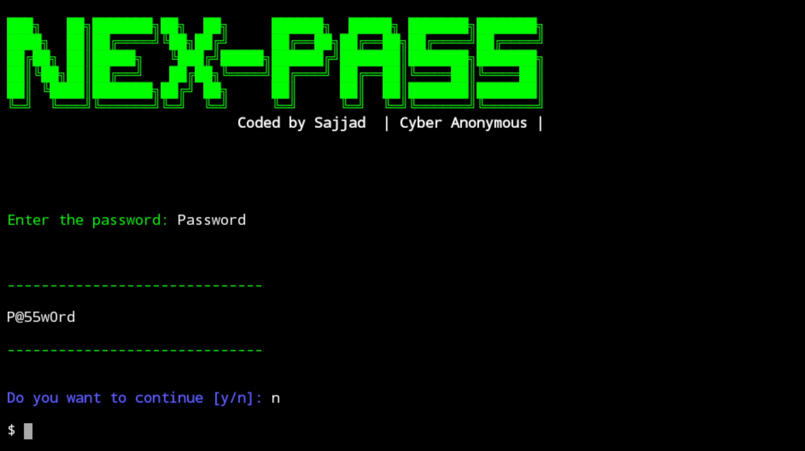

<h1 Align="Center"> Strong-Pass </h1>

### About Strong-Pass tool
Strong-Pass is generates a memorable strong password.

### Strong-Pass is available for
- Termux

### Screenshot


### Installation
```
$apt-get update -y
```
```
$apt-get upgrade -y
```
```
$pkg install python -y
```
```
$pkg install python3 -y
```
```
$pkg install git -y
```
```
$git clone https://www.github.com/Cyber-Anonymous/Strong-Pass
```
```
$cd
```
```
$ls
```
```
$cd Strong-Pass
```
```
$python3 strong-pass.py
```
Enter the password which you want to modify.

GitHub ID link: https://www.github.com/Cyber-Anonymous

### Warning:
**Strong-Pass is only for educational purposes. We are not responsible for any misuse or illegal purposes.**
